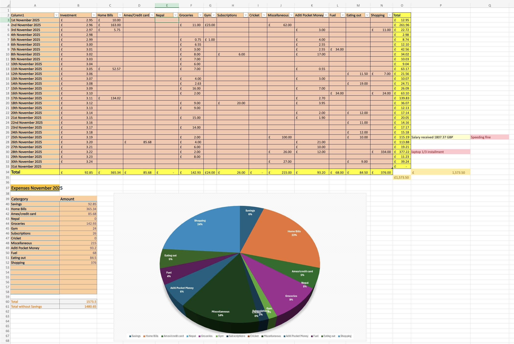

# Budget Analysis Application

This is a personal budget analysis application built to replace my Budget tracking Excel sheet.

The app helps track expenses, analyse spending patterns, and compare monthly spending against income.

## Purpose

I previously tracked expenses manually using Excel.
This project moves that process into an application that can:

- Store expenses
- Group spending by date and category
- Calculate monthly totals
- Provide a clear view of where money is spent

The repository is an MVP console based project which is designed to grow in complexity over time.

## Current Features

- Add expenses manually (CRUD)
- Store expense details such as:
    - Date
    - Category
    - Amount
    - Description
- View expenses by:
    - Day
    - Category
    - Month

## Planned Improvements

- Upload bank statements as CSV files
- Automatically extract and process transactions
- Categorise expenses based on transaction details
- Monthly summaries and comparisons
- Basic visual insights for spending patterns

## Tech Stack

- Java

## Why This Project

- Uses real-world financial data
- Focuses on backend design and logic
- Built incrementally from simple to advanced
- Demonstrates clean separation of logic and API layers

## Status

This project is under active development and is being expanded as part of learning. I am implementing my budget tracker
from excel in a Java console application, then eventually web application with Spring Boot framework.
